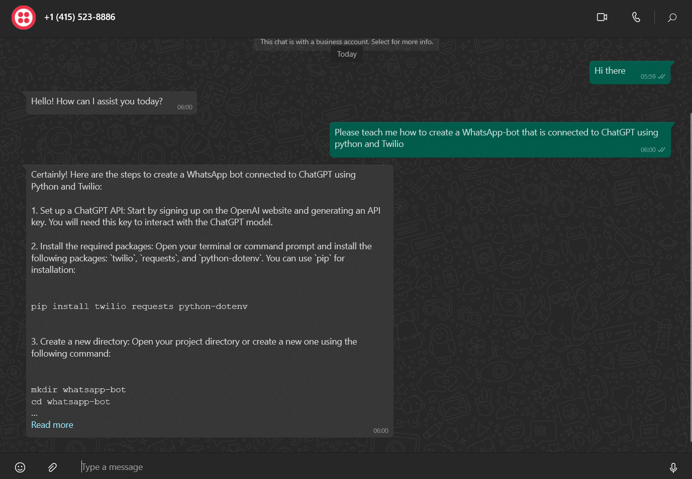

# AI-medical-bot-whatsapp

This repository contains a Python-based AI assistant that uses OpenAI's GPT-3.5 Turbo model to generate responses to user queries received via WhatsApp. The assistant leverages the Twilio API for WhatsApp communication and the OpenAI API for generating AI responses. It is built on the Flask framework and can be deployed on any server.




## Getting Started

These instructions will get you a copy of the project up and running on your local machine for development and testing purposes.

### Prerequisites

You need to have the following installed:
- Python 3.6 or later
- Flask
- Twilio
- OpenAI
- dotenv
- ngrok

You can install these packages using pip:
```bash
pip install flask twilio openai python-dotenv pyngrok
```

### Installing

1. Clone the repository:
```bash
git clone https://github.com/majestikmagik/AI-medical-bot-whatsapp.git
```

2. Navigate to the project directory:
```bash
cd AI-medical-bot-whatsapp
```

3. Obtain your Twilio SID and Auth Token:
- Sign up for a free Twilio account if you don't have one. You can do this by visiting the [Twilio website](https://www.twilio.com/try-twilio).
- Once you've signed up and logged in, you'll be directed to the Twilio Console Dashboard. Here, you'll find your Account SID and Auth Token. 
- Copy these values and store them in your ".env" file.
- Connect your WhatsApp to Twilio by sending a message from your device to +1 415 523 8886 with the code provided by Twilio (e.g., `join belong-nor`). The code will be different for each user.

4. Obtain your OpenAI API key:
- Sign up for an account on the [OpenAI website](https://beta.openai.com/signup/).
- After signing up and logging in, go to the API section in the dashboard.
- Here, you'll find your API key. Copy this value and store it in your ".env" file.

Remember to replace the placeholders in the ".env" file with your actual keys. This file is where your application will read the environment variables from. Please note that these keys are sensitive information and should not be shared or exposed publicly. Always keep them in a secure place.

5. Run the application:
```bash
python main.py
```

The application will start running at http://0.0.0.0:5000.

6. In a second terminal, start ngrok on the same port as your Flask app:
```bash
ngrok http 5000
```

7. Copy the Forwading URL provided by ngrok and append `/twilio/receiveMessage` to it. It should look something like this: `https://3674-41-150-219-60.ngrok.io/twilio/receiveMessage`.

8. Paste this URL in the Twilio sandbox configuration under "When a message comes in" and make sure the method is set to POST and save.

9. Your WhatsAppbot is now ready to receive messages.

## Usage

Send a POST request to the `/twilio/receiveMessage` endpoint with the following parameters:

- `Body`: The user's message
- `From`: The user's WhatsApp number in the format `whatsapp:+1234567890`

The AI assistant will respond to the user's message via WhatsApp.

## Contributing

Feel free to contribute for details on our code of conduct, and the process for submitting pull requests to us.

## License

This project is licensed under the MIT License - see the [MIT License] file for details.

## Acknowledgments

- OpenAI for their amazing GPT-3.5 model
- Twilio for their powerful communication APIs

## Contact

If you have any questions, feel free to open an issue or contact the repository owner.

- Email: amosmiller0312@gmail.com

## Future Ideas
- Voinenote capabilities (text-to-speech) - transcribe audio from user using openai whisper speech to text and reply with text
- Voinenote capabilities (speech-to-text) - transcribe audio from user using openai whisper speech to text and reply with audio from eleven labs.
- Add Memory using langchain conversation buffer memory.